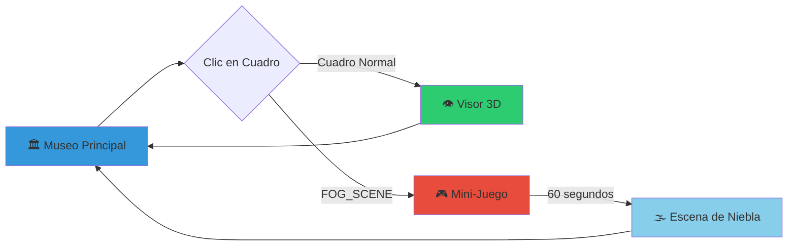

# 🏛️ 3D Art Museum - Interactive Virtual Gallery

[](https://www.typescriptlang.org/)
[](https://reactjs.org/)
[](https://threejs.org/)
[](https://vitejs.dev/)

> **Una galería de arte 3D inmersiva e interactiva construida con React Three Fiber, presentando obras de arte rural y tecnología sostenible**

## 🎯 Resumen del Proyecto

Un museo virtual 3D que combina arte contemporáneo, tecnología inmersiva y narrativa interactiva. El proyecto incluye múltiples experiencias: exploración de galería, visualización de modelos 3D, mini-juego integrado y escena atmosférica de niebla, todo construido con arquitectura modular y escalable.

### 🌟 Características Principales

- **🏛️ Galería Virtual 3D**: Museo completamente navegable con 8 obras de arte
- **🎮 Mini-Juego Integrado**: Super Runner 2D como transición interactiva
- **🌫️ Escena de Niebla**: Experiencia atmosférica con 40,000 partículas
- **📱 Multiplataforma**: Soporte completo para PC y dispositivos móviles
- **🎨 Modelos 3D Interactivos**: Sistema avanzado de visualización con controles Leva
- **⚡ Optimizado**: 60 FPS estables con técnicas avanzadas de performance

## 🎮 Flujo de Navegación Interactivo



### **Estados de Vista**

- `"gallery"` - Museo principal con 8 obras de arte
- `"modelViewer"` - Visor 3D con galería completa
- `"miniGame"` - Super Runner 2D (transición interactiva)
- `"fogScene"` - Experiencia atmosférica inmersiva

## 🛠️ Stack Tecnológico

### **Frontend Core**

- **React 18** - Hooks funcionales y Suspense
- **TypeScript 5.5** - Type safety y desarrollo robusto
- **Vite 5.4** - Build tool y desarrollo rápido
- **Tailwind CSS 3.4** - Utility-first styling

### **3D Graphics & WebGL**

- **Three.js 0.162** - Motor 3D de alto rendimiento
- **React Three Fiber 8.15** - Integración React-Three.js
- **React Three Drei 9.99** - Utilidades y helpers 3D avanzados
- **Leva 0.10** - Controles interactivos en tiempo real

### **Development & Tooling**

- **ESLint 9.9** - Linting y code quality
- **PostCSS 8.4** - CSS processing
- **Autoprefixer 10.4** - CSS vendor prefixes

### **Performance & Optimizations**

- **r3f-perf 7.2** - Performance monitoring
- **AdaptiveDpr** - Renderizado adaptativo
- **Preload** - Carga optimizada de assets

## 🏗️ Arquitectura del Sistema

### **🎯 Patrón Arquitectónico: Feature-Based Modular**

```
src/
├── 🎛️ core/                    # Sistema central unificado
│   ├── config/                 # Configuración centralizada
│   ├── models/                 # Sistema de modelos 3D
│   │   ├── BaseModel3D.tsx    # Componente universal
│   │   ├── ModelRegistry.ts   # Registry centralizado
│   │   └── behaviors/         # Comportamientos específicos
│   └── types/                 # Tipos TypeScript unificados
├── 🎨 components/             # Componentes del museo
│   ├── museum/               # Arquitectura de la galería
│   └── ui/                   # Interfaz de usuario
├── 🎮 features/              # Características modulares
│   ├── model-viewer/         # Visor 3D avanzado
│   ├── fog-scene/           # Escena atmosférica
│   └── mini-game/           # Super Runner 2D
├── 🎭 contexts/              # Estado global React
└── 🔧 utils/                # Utilidades compartidas
```

### **🏛️ Sistema de Modelos 3D Unificado**

**Arquitectura BaseModel3D**: Componente universal que maneja todos los modelos 3D con behaviors específicos por tipo:

- **PEPE**: Animaciones de proximidad y secuencias automáticas
- **WINDOW**: Materiales de vidrio translúcido con refracción
- **WINDOW_VIEW**: Controles Leva interactivos en tiempo real
- **ANCEU**: Transformaciones complejas y cálculos de escala automáticos
- **MAN_ON_FOREST**: Enhancement de materiales para escena de niebla
- **BENCH**: Geometría específica con preservación de nodos
- **PLANTS/LAMPS**: Modelos genéricos optimizados

```typescript
// Uso del sistema unificado
<BaseModel3D modelId="PEPE" />
<BaseModel3D modelId="WINDOW_VIEW" />
<BaseModel3D modelId="ANCEU" />
```

### **⚙️ Registry Centralizado**

Todos los modelos están registrados en un sistema tipo-seguro que garantiza configuraciones correctas:

```typescript
const PEPE_MODEL_CONFIG: PepeModelConfig = {
  type: "PEPE",
  path: "/models/pepe.glb",
  initialPosition: { x: -19.1, y: -2.5, z: -7.4 },
  proximityDistance: 5.0,
  animationConfig: {
    walking1Duration: 3.0,
    rotatingDuration: 2.0,
    walkingDistance: 2.4,
    finalRotationY: -0.9,
    resetDistanceThreshold: 7.0,
  },
  behaviors: ["proximity", "movement", "animation"],
};
```

### **🎛️ Behaviors System**

Cada modelo tiene behaviors específicos que definen su comportamiento:

- **PepeBehaviors**: Animaciones de proximidad con detección de jugador
- **WindowBehaviors**: Materiales de vidrio con transmission y clearcoat
- **WindowViewBehaviors**: Controles Leva en tiempo real + material enhancement
- **AnceuBehaviors**: Transformaciones complejas con cálculos automáticos
- **ManOnForestBehaviors**: Sistema para fog scene con enhancement atmosférico

## 🎨 Características Técnicas Avanzadas

### **🎮 Mini-Juego Super Runner 2D**

- **Engine**: HTML5 Canvas con RequestAnimationFrame game loop
- **Mecánicas**: Sistema de vidas (5 iniciales), power-ups, combo multipliers
- **Controles**: Espacio=saltar, E=disparar, ↓=agacharse, Shift=correr, A/D=lateral
- **Power-ups**: ⚡Velocidad, 🛡️Escudo, 🦘Doble Salto, ❤️Vida Extra
- **Integración**: Transición seamless museo → juego → fog scene
- **Performance**: 60 FPS estables con optimizaciones de game loop
- **Persistencia**: High scores en LocalStorage con botón salida anticipada

### **🌫️ Fog Scene - Sistema de Partículas Masivo**

- **Partículas**: 40,000 activas (8,000 × 5 capas distribuidas)
- **Área explorable**: 980×980 unidades con límites de rebote suave
- **Shaders**: Vertex/Fragment personalizados con THREE.AdditiveBlending
- **Optimización**: Frame skipping (actualización cada 2 frames), culling inteligente
- **Controles**: WASD + ratón + PointerLock (PC) | Touch direccional + camera drag (móvil)
- **Modelo 3D**: ManOnForest con controles Leva y posición optimizada (x:9, y:40, z:141)
- **Colisiones**: Sistema invisible con feedback visual en perímetros

### **📱 Soporte Móvil Completo**

- **Detección automática**: viewport ≤768px, 'ontouchstart', maxTouchPoints > 0
- **Controles táctiles**: Botones direccionales atmosféricos (↑↓←→) estilo fog scene
- **Camera touch**: Arrastrar para rotar con límites verticales anti-flip
- **Event handling**: Non-passive touch events para máximo rendimiento
- **UI adaptativa**: Instrucciones específicas por plataforma + loading diferenciado

### **⚡ Optimizaciones de Performance**

- **AdaptiveDpr**: Ajuste automático de pixel ratio (dpr=[1,2]) según hardware
- **AdaptiveEvents**: Gestión inteligente de eventos con frecuencia adaptativa
- **Frustum Culling**: Objetos fuera de vista no se renderizan automáticamente
- **Material Cloning**: Evita modificar assets originales (scene.clone())
- **Texture Optimization**: LinearMipmapLinearFilter, RepeatWrapping optimizado
- **Shadow Mapping**: 1024x1024 mapSize, cascaded shadows para modelos
- **Preload**: Carga anticipada de assets críticos con useGLTF.preload()
- **Suspense**: Lazy loading de componentes pesados con React.Suspense

## 🎯 Casos de Uso y Demostraciones

### **🎨 Para Artistas y Curadores**

- Exhibición de obras de arte en contexto 3D inmersivo
- Información detallada con enlaces a redes sociales
- Sistema de navegación intuitivo tipo museo real

### **🏛️ Para Instituciones Culturales**

- Plantilla escalable para museos virtuales
- Integración con colecciones existentes
- Accesibilidad multiplataforma

### **💻 Para Desarrolladores**

- Arquitectura modular y escalable
- Sistema de componentes reutilizables
- Documentación completa de APIs

### **🎮 Para Experiencias Interactivas**

- Gamificación de contenido cultural
- Transiciones narrativas inmersivas
- Multi-modal (3D + 2D + interactivo)

## 🚀 Instalación y Desarrollo

### **Requisitos**

- Node.js 18+
- npm/yarn/pnpm
- GPU moderna con soporte WebGL 2.0

### **Setup Rápido**

```bash
# Clonar repositorio
git clone https://github.com/tu-usuario/artwork-3D-museum.git
cd artwork-3D-museum

# Instalar dependencias
npm install

# Desarrollo
npm run dev

# Build para producción
npm run build

# Preview del build
npm run preview
```

### **Scripts Disponibles**

- `npm run dev` - Servidor de desarrollo con HMR
- `npm run build` - Build optimizado para producción
- `npm run lint` - Análisis de código con ESLint
- `npm run preview` - Preview del build de producción

## 📋 Estructura de Features

### **🏛️ Museum Gallery**

- Navegación 3D con cámara libre
- Sistema de frames con texturas PBR
- Iluminación avanzada con spot lights
- Arquitectura detallada (paredes, suelo, techo)

### **👁️ Model 3D Viewer**

- Carga optimizada de modelos GLB/GLTF
- Sistema de controles touch/mouse
- Galería completa con mobiliario
- Loading system con BlackHole animation

### **🎮 Mini-Game Integration**

- Endless runner con mecánicas completas
- Sistema de achievements y high scores
- Integración fluida en el flujo principal
- LocalStorage para persistencia

### **🌫️ Atmospheric Fog Scene**

- Exploración libre en primera persona
- Modelo 3D con controles Leva
- Sistema de colisiones invisible
- Partículas procedurales masivas

## 🎨 Assets y Modelos 3D

### **Modelos Incluidos (13 GLB/GLTF)**

- **Pepe** (`pepe.glb`): 🤖 **Personaje generado 100% con IA** - Modelo creado desde imagen con técnicas de AI generativo, incluyendo proximity detection + walking sequences animadas
- **ManOnForest** (`ManOnForest.glb`): 📱 **Escaneado con LiDAR móvil** - Capturado con smartphone y renderizado en la nube, optimizado para fog scene (8x scale)
- **Anceu** (`Anceu-Coliving-30-5-2025-textured_model.glb`): 🏗️ **Arquitectura LiDAR** - Escaneado con tecnología móvil y procesamiento cloud, auto-scaling complejo
- **Window/WindowView** (`window.glb`, `window-view.glb`): Sistema ventana con vidrio translúcido
- **Plants** (4x): `planta1-4.glb` + `planta_exterior.glb` - Vegetación decorativa
- **Lamps** (2x): `lampara_2.glb`, `lampara_de_techo_moon_metal_negro.glb`
- **Metal Bench** (`metal_bench.glb`): Geometría específica Object_4/Metal material

### **Pipeline de Creación 3D Innovador**

#### **🤖 Modelos Generados con IA**

- **Pepe**: Creado desde imagen 2D usando algoritmos de IA generativa
- **Proceso**: Imagen → AI Model → GLB optimization → Animation rigging
- **Resultado**: Personaje completamente funcional con walking sequences

#### **📱 Escaneado LiDAR Móvil**

- **ManOnForest & Anceu**: Capturados con iPhone/Android LiDAR
- **Proceso**: Scan móvil → Cloud processing → Mesh optimization → Texture mapping
- **Ventajas**: Precisión submilimétrica, geometría real, texturizado automático

### **Texturas PBR (8K Resolution)**

- **Rock Wall**: `/textures/rock-wall-mortar-ue/` - Albedo, Normal, Roughness, Metallic, AO, Height
- **Bamboo Wood**: `/textures/.../bamboo-wood-semigloss-bl/` - Albedo, Normal, AO para suelos
- **Configuración**: RepeatWrapping, LinearMipmapLinear, repeat.set(4,2) optimizado

## 🔧 Configuración y Customización

### **Configuración Centralizada**

Todo el comportamiento del sistema está centralizado en `src/core/config/index.ts`:

```typescript
export const MUSEUM_SCENE_CONFIG = {
  floorY: -1.5,
  cameraHeight: 1.7,
  playerSpeed: 5.0,
  roomBounds: {
    /* ... */
  },
};

export const FOG_SCENE_CONFIG = {
  particles: { count: 8000 },
  boundaries: { wallDistance: 490 },
  /* ... */
};
```

### **Añadir Nuevos Modelos**

```typescript
// 1. Agregar path en MODEL_PATHS
export const MODEL_PATHS = {
  NUEVOS: {
    MI_MODELO: "/models/mi-modelo.glb",
  },
};

// 2. Crear configuración específica
const MI_MODELO_CONFIG: GenericModelConfig = {
  type: "GENERIC",
  path: MODEL_PATHS.NUEVOS.MI_MODELO,
  castShadow: true,
  receiveShadow: true,
  behaviors: ["staticModel"],
};

// 3. Registrar en ModelRegistry
this.registerModel("MI_MODELO", MI_MODELO_CONFIG);

// 4. Usar en cualquier componente
<BaseModel3D modelId="MI_MODELO" />;
```

## 📊 Performance Metrics

### **Benchmarks**

- **FPS**: 60 estables en hardware moderno
- **Tiempo de carga**: < 3 segundos primera visita
- **Memoria**: < 500MB uso RAM típico
- **Bundle size**: ~1.6MB comprimido

### **Optimizaciones Implementadas**

- Lazy loading de componentes con Suspense
- Preload inteligente de assets críticos
- Adaptive quality basado en GPU
- Frame skipping en sistemas de partículas
- Material instancing para objetos repetidos

## 🤝 Contribución y Desarrollo

### **Guías de Contribución**

1. Fork del proyecto
2. Feature branch (`git checkout -b feature/AmazingFeature`)
3. Commit cambios (`git commit -m 'Add AmazingFeature'`)
4. Push a la rama (`git push origin feature/AmazingFeature`)
5. Pull Request

### **Coding Standards**

- TypeScript strict mode
- ESLint configuration compliance
- Functional components con hooks
- Arquitectura modular por features

## 🏆 Showcases Técnicos y Arquitectónicos

Este proyecto demuestra competencias avanzadas en:

### **🎯 Arquitectura de Software**

- **Feature-Based Modular Design** con separación de responsabilidades
- **Registry Pattern** para gestión centralizada de modelos 3D
- **Behavior Pattern** para funcionalidades específicas por tipo
- **Factory Pattern** para creación de modelos unificados
- **Provider Pattern** para estado global con Context API

### **🤖 Tecnologías de Generación 3D Avanzadas**

- **AI-Generated 3D Models** - Personaje Pepe creado desde fotografía 2D usando IA generativa
- **Mobile LiDAR Scanning** - Captura de modelos reales con tecnología LiDAR en smartphone
- **Cloud-Based Rendering** - Procesamiento de datos LiDAR en infraestructura cloud distribuida
- **Hybrid Asset Pipeline** - Combinación de modelos AI + LiDAR + tradicionales en single scene
- **Photogrammetry Integration** - Texturas de alta resolución con captura fotográfica

### **🚀 Performance Engineering**

- **WebGL Optimization** con Three.js y React Three Fiber
- **Memory Management** con clonado seguro y dispose patterns
- **Rendering Optimization** con frustum culling y adaptive quality
- **Asset Management** con preloading inteligente y lazy loading
- **Frame Rate Optimization** alcanzando 60 FPS con 40K partículas

### **📱 Cross-Platform Development**

- **Responsive 3D Design** adaptativo desktop/mobile
- **Touch Interface Design** con controles nativos por plataforma
- **Progressive Enhancement** con detección automática de capacidades
- **Accessibility** con soporte completo para diferentes dispositivos

### **🎮 Interactive Experience Design**

- **Gamification Integration** con mini-juego seamless
- **Narrative Flow Design** guiando al usuario entre experiencias
- **State Management** complejo con múltiples contextos
- **Real-time Interactivity** con Leva controls y animaciones procedurales

## 📝 Licencia

MIT License - ver [LICENSE.md](LICENSE.md) para detalles.

## 👥 Equipo y Reconocimientos

**Desarrollo Principal**

- Arquitectura y sistema 3D unificado
- Optimizaciones de performance
- Integración de features modulares

**Arte y Contenido**

- [@stass_cam](https://www.instagram.com/stass_cam) - Murales forestales
- [@sketchyshona](https://www.instagram.com/sketchyshona) - Mural del hombre rural
- **Mery** - Tapiz natural
- **RuralHackers** - Concepto y dirección

## 🌐 Enlaces

- **Website**: [RuralHackers.org](https://ruralhackers.org)
- **Sostenibilidad**: [ruralhackers.org/sostenibilidad](https://ruralhackers.org/sostenibilidad)
- **Emprendimiento**: [ruralhackers.org/emprendimiento](https://ruralhackers.org/emprendimiento)
- **Colaboración**: [ruralhackers.org/colaboracion](https://ruralhackers.org/colaboracion)

---

**🎯 Un proyecto que combina arte, tecnología y sostenibilidad en una experiencia 3D inmersiva única**
