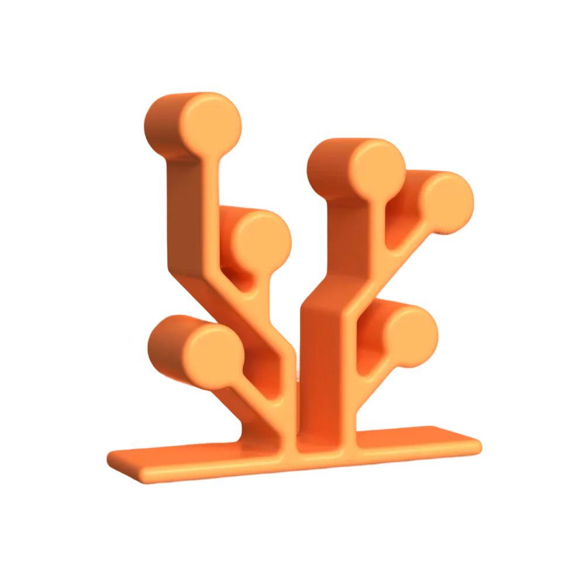
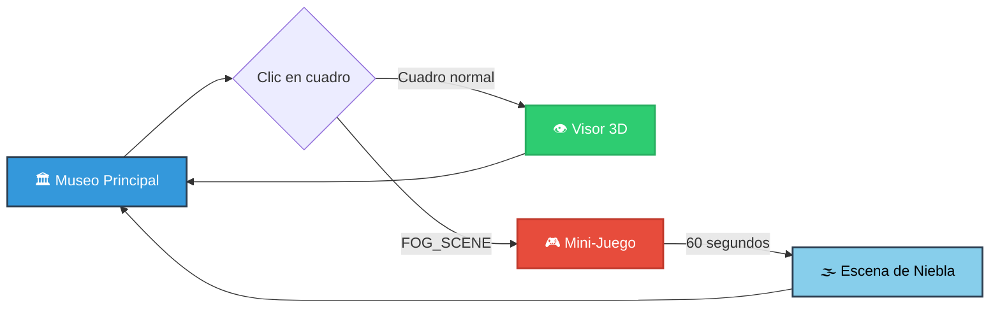
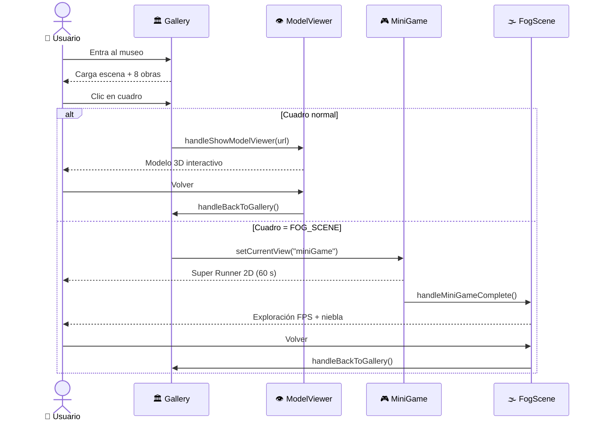
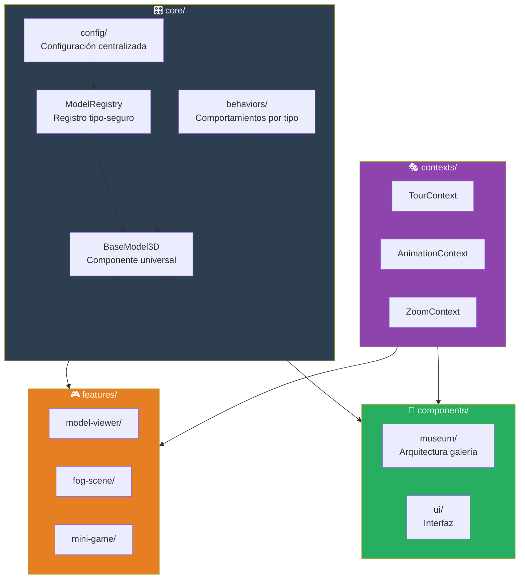
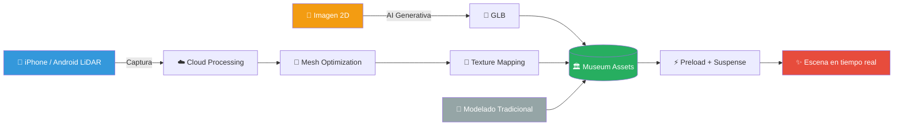

<div align="center">



# 🏛️ Rural Hacker Museum

### _Una galería de arte 3D inmersiva que fusiona **naturaleza rural**, **tecnología inmersiva** y **arte generativo**_

<p>
  <a href="https://ruralhackers.com"></a>
  <a href="#-instalación-y-desarrollo"></a>
  <a href="LICENSE.md"></a>
  <a href="#-equipo-y-reconocimientos"></a>
</p>

<p>
  
  
  
  
  
  
  
  
</p>

<sub>⭐ 4 experiencias interactivas · 🎨 13 modelos 3D · ⚡ 60 FPS · 🌫️ 40.000 partículas · 📱 Mobile ready</sub>

</div>

---

## 📑 Tabla de Contenidos

<table>
<tr>
<td>

- [✨ Qué es esto](#-qué-es-esto)
- [🎬 Experiencias](#-experiencias)
- [🎮 Flujo de navegación](#-flujo-de-navegación)
- [🧩 Arquitectura](#-arquitectura)
- [🛠️ Stack tecnológico](#️-stack-tecnológico)

</td>
<td>

- [🧠 Pipeline de assets 3D](#-pipeline-de-assets-3d)
- [⚡ Performance](#-performance)
- [🚀 Instalación y desarrollo](#-instalación-y-desarrollo)
- [🧱 Añadir nuevos modelos](#-añadir-nuevos-modelos)
- [👥 Equipo y reconocimientos](#-equipo-y-reconocimientos)

</td>
</tr>
</table>

---

## ✨ Qué es esto

> **Rural Hacker Museum** es un museo virtual 3D completamente navegable que combina arte contemporáneo, escaneos LiDAR reales, personajes generados con IA y un mini-juego como transición narrativa. Todo construido con una arquitectura modular y escalable sobre **React Three Fiber**.

<table>
<tr>
<td width="50%" valign="top">

### 🌟 Lo que lo hace especial

- 🏛️ **Museo navegable en 3D** con 8 obras expuestas
- 🎮 **Mini-juego integrado** _Super Runner 2D_ como transición
- 🌫️ **Escena de niebla** con **40.000 partículas** explorables
- 🤖 **Modelo Pepe** generado 100% con IA desde una imagen 2D
- 📱 **Captura LiDAR móvil** con procesamiento en cloud
- ⚡ **60 FPS estables** con optimizaciones avanzadas

</td>
<td width="50%" valign="top">

### 🎯 Diseñado para

- 🎨 Artistas y curadores que quieran exhibir obras en 3D
- 🏛️ Instituciones culturales buscando plantillas escalables
- 💻 Devs interesados en arquitectura modular con R3F
- 🎮 Creadores de experiencias interactivas e inmersivas
- 🧑‍🔬 Investigación en arte + tecnología + sostenibilidad

</td>
</tr>
</table>

---

## 🎬 Experiencias

| Vista | Descripción | Tecnología clave |
|:---:|:---|:---|
| 🏛️ **Gallery** | Museo principal con 8 obras, cámara libre, iluminación PBR y spotlights | R3F · Drei · Three.js |
| 👁️ **Model Viewer** | Visor 3D con galería completa de modelos GLB/GLTF y controles táctiles | GLTF Loader · Leva |
| 🎮 **Mini-Game** | Super Runner 2D — 60 s de endless runner con power-ups y combos | HTML5 Canvas · RAF |
| 🌫️ **Fog Scene** | Exploración FPS con 40 K partículas procedurales y colisiones invisibles | Custom Shaders · PointerLock |

---

## 🎮 Flujo de navegación



<details>
<summary><b>📖 Ver secuencia de interacción detallada</b></summary>



</details>

---

## 🧩 Arquitectura

> 🎯 **Patrón arquitectónico:** Feature-Based Modular con _Registry_, _Behavior_ y _Factory Pattern_.



<details>
<summary><b>📁 Ver estructura de carpetas</b></summary>

```text
src/
├── 🎛️ core/                   # Sistema central unificado
│   ├── config/                # Configuración centralizada
│   ├── models/
│   │   ├── BaseModel3D.tsx    # Componente universal
│   │   ├── ModelRegistry.ts   # Registry tipo-seguro
│   │   └── behaviors/         # Behaviors específicos
│   └── types/                 # Tipos TypeScript unificados
├── 🎨 components/
│   ├── museum/                # Arquitectura de la galería
│   └── ui/                    # Interfaz de usuario
├── 🎮 features/
│   ├── model-viewer/          # Visor 3D avanzado
│   ├── fog-scene/             # Escena atmosférica
│   └── mini-game/             # Super Runner 2D
├── 🎭 contexts/               # Estado global React
└── 🔧 utils/                  # Utilidades compartidas
```

</details>

### 🏛️ Sistema de modelos unificado

El componente `BaseModel3D` + `ModelRegistry` garantiza **configuraciones tipo-seguras** para todos los modelos:

```typescript
<BaseModel3D modelId="PEPE" />        // 🤖 IA generativa + animación
<BaseModel3D modelId="WINDOW_VIEW" /> // 🪟 Leva + material enhancement
<BaseModel3D modelId="ANCEU" />       // 📱 LiDAR móvil + auto-scaling
```

| Modelo | Behaviors | Origen |
|:---|:---|:---:|
| `PEPE` | proximity · movement · animation | 🤖 IA |
| `WINDOW` | glass · clearcoat · transmission | 🎨 Manual |
| `WINDOW_VIEW` | leva controls · material enhancement | 🎨 Manual |
| `ANCEU` | auto-scale · complex transforms | 📱 LiDAR |
| `MAN_ON_FOREST` | atmospheric enhancement | 📱 LiDAR |
| `BENCH / PLANTS / LAMPS` | static optimized | 🎨 Manual |

---

## 🛠️ Stack tecnológico

<table>
<tr>
<td align="center" width="20%">
<br/>
<b>React 18</b><br/>
<sub>Hooks + Suspense</sub>
</td>
<td align="center" width="20%">
<br/>
<b>TypeScript 5.5</b><br/>
<sub>Strict mode</sub>
</td>
<td align="center" width="20%">
<br/>
<b>Three.js 0.162</b><br/>
<sub>WebGL 2.0</sub>
</td>
<td align="center" width="20%">
<br/>
<b>Vite 5.4</b><br/>
<sub>HMR + Build</sub>
</td>
<td align="center" width="20%">
<br/>
<b>Tailwind 3.4</b><br/>
<sub>Utility-first</sub>
</td>
</tr>
</table>

<details>
<summary><b>🔎 Ver dependencias completas</b></summary>

| Categoría | Librerías |
|:---|:---|
| **3D & WebGL** | `three@0.162` · `@react-three/fiber@8.15` · `@react-three/drei@9.99` · `leva@0.10` |
| **UI & Styling** | `tailwindcss@3.4` · `styled-components@6.1` · `lucide-react` · `react-swipeable` |
| **Tooling** | `vite@5.4` · `eslint@9.9` · `typescript-eslint@8.3` · `postcss@8.4` · `autoprefixer@10.4` |
| **Performance** | `r3f-perf@7.2` · `AdaptiveDpr` · `AdaptiveEvents` · `Preload` |

</details>

---

## 🧠 Pipeline de assets 3D

> Un pipeline híbrido que combina **IA generativa**, **escaneo LiDAR móvil** y modelado tradicional.



### 📦 Assets incluidos (13 modelos GLB/GLTF)

| Modelo | Origen | Descripción |
|:---|:---:|:---|
| `pepe.glb` | 🤖 | Personaje generado con IA desde imagen 2D · proximity detection + walking sequences |
| `ManOnForest.glb` | 📱 | Escaneado con smartphone LiDAR · renderizado en cloud · optimizado para fog (8× scale) |
| `Anceu-Coliving-…glb` | 📱 | Arquitectura LiDAR + procesamiento cloud · auto-scaling complejo |
| `window.glb` / `window-view.glb` | 🎨 | Sistema ventana con vidrio translúcido + clearcoat |
| `planta1-4.glb` + `planta_exterior.glb` | 🎨 | Vegetación decorativa |
| `lampara_2.glb` + `lampara_de_techo_moon_metal_negro.glb` | 🎨 | Iluminación |
| `metal_bench.glb` | 🎨 | Mobiliario con material preservation |

### 🧵 Texturas PBR

- 🪨 **Rock Wall** — Albedo · Normal · Roughness · Metallic · AO · Height
- 🎋 **Bamboo Wood** — Albedo · Normal · AO (suelos)
- ⚙️ **Configuración:** `RepeatWrapping` · `LinearMipmapLinear` · `repeat.set(4, 2)`

---

## ⚡ Performance

<div align="center">

| Métrica | Valor |
|:---:|:---:|
|  | Hardware moderno |
|  | Primera visita |
|  | Uso típico |
|  | Comprimido |
|  | En fog scene |

</div>

### 🔧 Optimizaciones implementadas

- ⚡ **AdaptiveDpr** — pixel ratio adaptativo `[1, 2]` según hardware
- 👁️ **Frustum Culling** automático para objetos fuera de vista
- 🧬 **Material Cloning** con `scene.clone()` (no modifica originales)
- 💾 **Preload** anticipado con `useGLTF.preload()`
- 🦥 **Suspense + lazy loading** para componentes pesados
- 🎞️ **Frame skipping** en sistemas de partículas (cada 2 frames)
- 🌑 **Shadow Mapping** 1024×1024 con cascaded shadows

---

## 🚀 Instalación y desarrollo

### Requisitos

  

### Setup rápido

```bash
# 1️⃣ Clonar el repositorio
git clone https://github.com/aleglope/ruralhackermuseum.git
cd ruralhackermuseum

# 2️⃣ Instalar dependencias
npm install

# 3️⃣ Lanzar servidor de desarrollo
npm run dev

# 4️⃣ Build para producción
npm run build && npm run preview
```

### Scripts disponibles

| Script | Descripción |
|:---|:---|
| `npm run dev` | 🔥 Servidor de desarrollo con HMR |
| `npm run build` | 📦 Build optimizado para producción |
| `npm run preview` | 👀 Preview del build |
| `npm run lint` | 🧹 Análisis de código con ESLint |

---

## 🧱 Añadir nuevos modelos

<details>
<summary><b>Ver ejemplo paso a paso</b></summary>

```typescript
// 1️⃣ Agregar path en MODEL_PATHS
export const MODEL_PATHS = {
  NUEVOS: {
    MI_MODELO: "/models/mi-modelo.glb",
  },
};

// 2️⃣ Crear configuración específica
const MI_MODELO_CONFIG: GenericModelConfig = {
  type: "GENERIC",
  path: MODEL_PATHS.NUEVOS.MI_MODELO,
  castShadow: true,
  receiveShadow: true,
  behaviors: ["staticModel"],
};

// 3️⃣ Registrar en ModelRegistry
this.registerModel("MI_MODELO", MI_MODELO_CONFIG);

// 4️⃣ Usar en cualquier componente
<BaseModel3D modelId="MI_MODELO" />;
```

</details>

---

## 🏆 Showcases técnicos

| Área | Demostraciones |
|:---|:---|
| 🎯 **Arquitectura** | Feature-Based Modular · Registry · Behavior · Factory · Provider patterns |
| 🤖 **Generación 3D** | AI-generated models · Mobile LiDAR · Cloud rendering · Hybrid asset pipeline |
| 🚀 **Performance** | WebGL optimization · Memory dispose · Frustum culling · 60 FPS @ 40K partículas |
| 📱 **Cross-platform** | Responsive 3D · Touch interface · Progressive enhancement |
| 🎮 **Interactivo** | Gamification · Narrative flow · Real-time Leva controls · Multi-context state |

---

## 👥 Equipo y reconocimientos

<table>
<tr>
<td align="center" width="33%">
<b>🏗️ Desarrollo principal</b><br/><br/>
Arquitectura 3D unificada<br/>
Performance engineering<br/>
Integración de features
</td>
<td align="center" width="33%">
<b>🎨 Arte y contenido</b><br/><br/>
<a href="https://www.instagram.com/stass_cam">@stass_cam</a> — Murales forestales<br/>
<a href="https://www.instagram.com/sketchyshona">@sketchyshona</a> — Mural rural<br/>
<b>Mery</b> — Tapiz natural
</td>
<td align="center" width="33%">
<b>💡 Concepto y dirección</b><br/><br/>
<a href="https://ruralhackers.com"><b>RuralHackers</b></a><br/>
<sub>Tecnología rural y sostenible</sub>
</td>
</tr>
</table>

---

## 🌐 Enlaces

<div align="center">

<a href="https://ruralhackers.com"></a>
<a href="https://www.instagram.com/stass_cam"></a>
<a href="https://www.instagram.com/sketchyshona"></a>

</div>

---

## 📝 Licencia

Distribuido bajo licencia **MIT**. Ver [`LICENSE.md`](LICENSE.md) para más detalles.

<div align="center">

---

### 🎯 _Arte, tecnología y sostenibilidad en una experiencia 3D inmersiva única_

<sub>Hecho con ❤️ por <b><a href="https://ruralhackers.com">RuralHackers</a></b> · Powered by React Three Fiber</sub>


</div>
